# QNN 文档阅读

`QNN SDK` 的核心文档在目录 `$QNN_SDK_ROOT/docs/QNN/` 下, 这里的 `api-rst` 和 `OpDef` 的核心文档在官网上没有。

- `OpDef`： “算子定义和后端支持” 文档，包括 `Op` 在不同设备的支持性、约束等信息。
- `api-rst`： “API 参考” 文档， 包括各个 `api` 的参数、功能、返回值等细节。

## 1. OpDef

下面以 `MatMul`，介绍一下 `OpDef` 里都有什么内容，在主文档 `$QNN_SDK_ROOT/docs/QNN/OpDef/MasterOpDef.html?highlight=matmul#matmul` 中可以看到算子 `MatMul` 的定义和输入输出参数等信息，如下图。
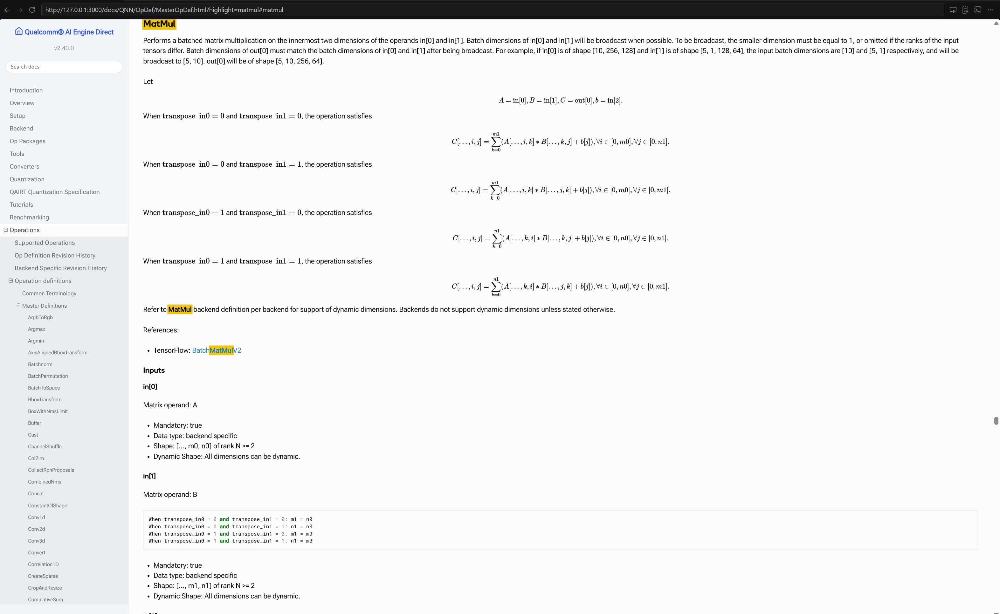
可以看到算子定义矩阵乘法为$C = A \times B + b$, 有额外参数 `transpose_in0` 和 `transpose_in1`，控制输入矩阵的转置方式，从而影响计算结果。

这里的输入参数的数据类型是后端特定的，而不同后端又有自己特定的文档描述算子的支持情况和约束条件，例如 `HTP` 后端的 `MatMul` 算子定义和约束条件可以在 `$QNN_SDK_ROOT/docs/QNN/OpDef/HtpOpDefSupplement.html?highlight=matmul#matmul` 看到。

### 1.1 数据结构
首先是输入输出的数据结构，如下图, 当前 `HTP` 后端支持的数据格式是 `FP16/INT16/INT8`，
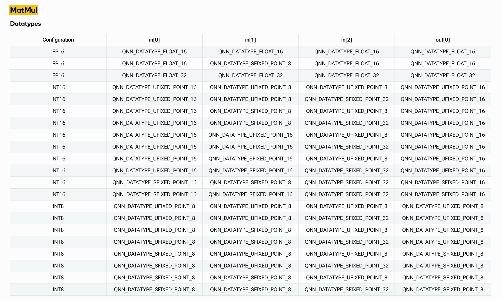

### 1.2 约束说明

`HTP` 后端对 `MatMul` 计算的数据维度不超过5维，另外对于各个精度的输入输出也有不同的约束，具体可以看下图。
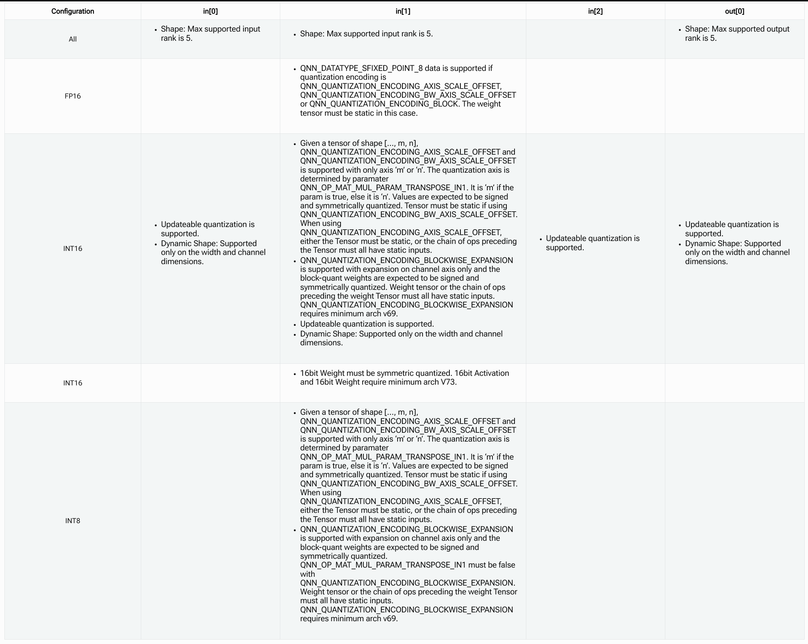

这里针对不同的输入有不同的量化限制
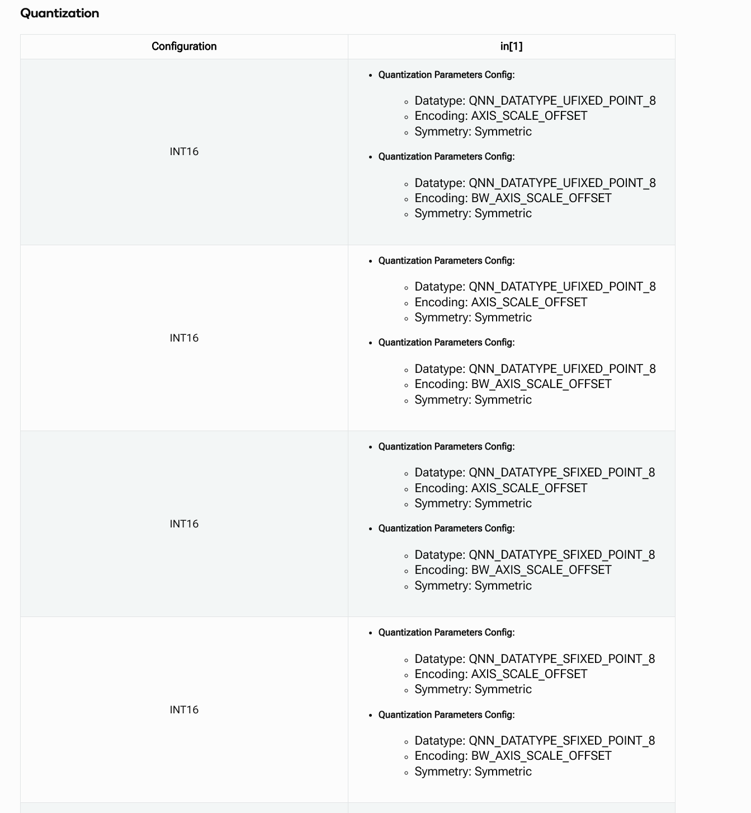

## 2. api-rst

以 `QnnGraph_addNode` 接口为例展开，可以通过搜索直接搜索 `api` 接口，如下
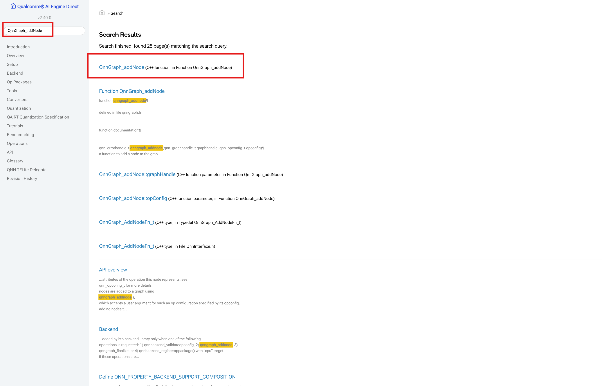
接下来查看 `QnnGraph_addNode` 接口的定义，可以看到该接口的参数和返回值等信息，如下图, 其输入参数为图句柄 `Qnn_GraphHandle_t` 和节点信息结构体 `Qnn_OpConfig_t`，返回值为状态码 `Qnn_ErrorHandle_t`。
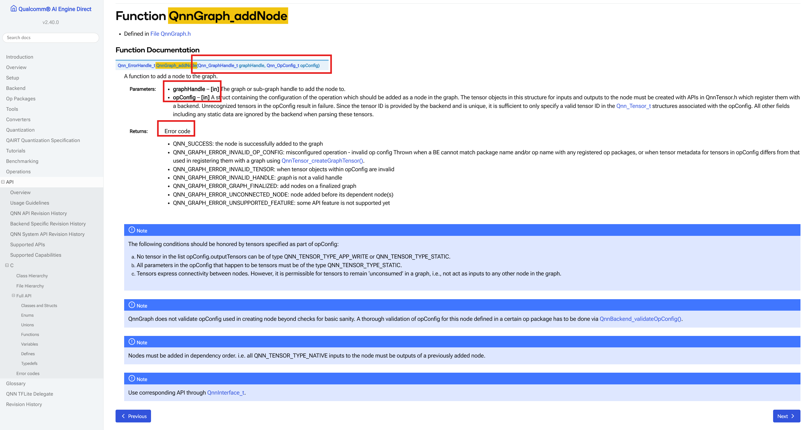
可以继续深入，点击 `Qnn_OpConfig_t` 可以跳转到对应的结构体的定义，查看其字段信息，如下图, 该结构体包含了节点的版本和对应版本的结构体，当前只有 `Qnn_OpConfig_v1_t` 版本的字段信息。
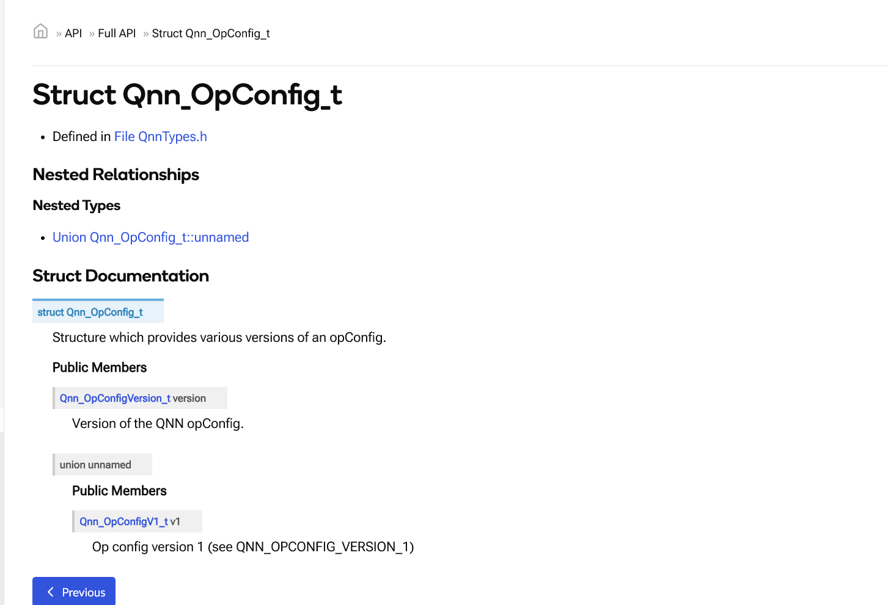
继续点击查看 `Qnn_OpConfig_v1_t` 结构体的定义，可以看到该结构体包含了节点的名称、算子名称、额外输入参数数量、额外输入参数信息(上面提到的 `transpose_in0` 和 `transpose_in1` 就是这个参数)、输入张量指针、输出张量指针等字段信息，如下图。
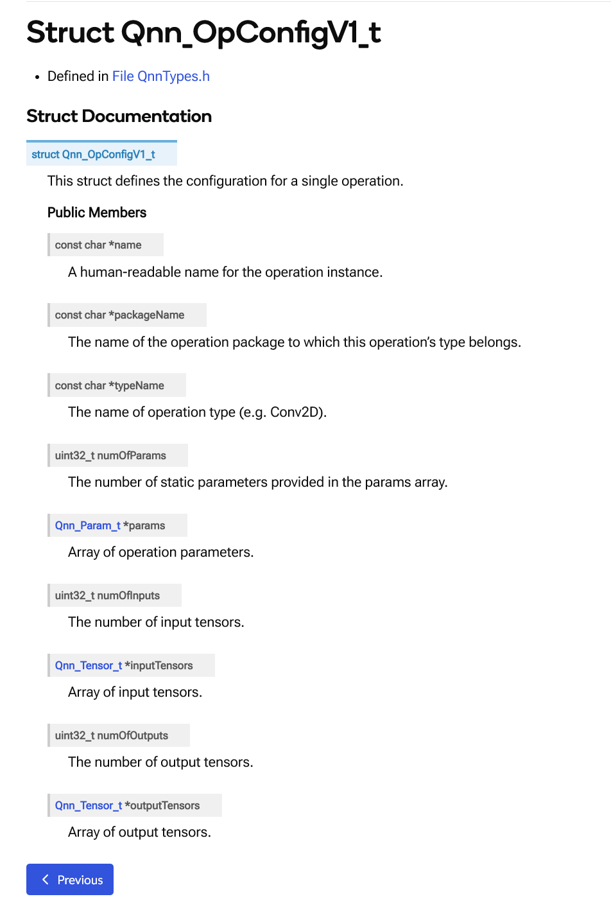
可以继续向下追溯张量结构体的结构。

## 3. 量化

在算子定义中看到了量化方法的约束，接下来顺着 `Qnn_TensorV1_t` 张量分析量化方式，从下面入口查看 `Qnn_QuantizeParams_t` 量化参数的定义
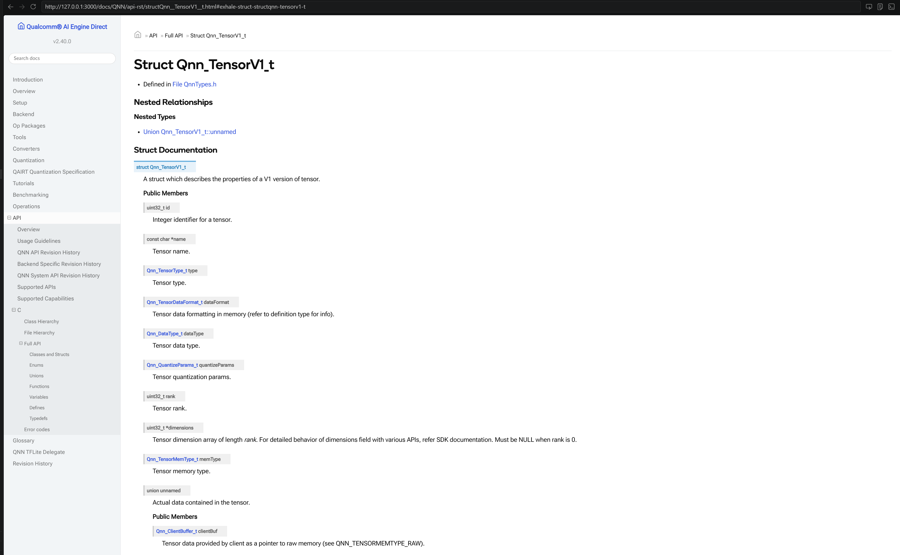
结构体包括 定义方式、量化方式、量化参数，共有8中量化方式，包括缩放量化(`Qnn_ScaleOffset_t`)、零点量化(`Qnn_AxisScaleOffset_t`)等,
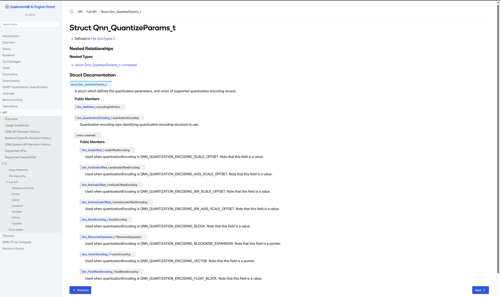
具体可以继续深入查看，例如 `Qnn_AxisScaleOffset_t` 结构体的定义如下图, 该结构体包含了量化轴、量化参数数量、缩放值与零点值等字段信息。
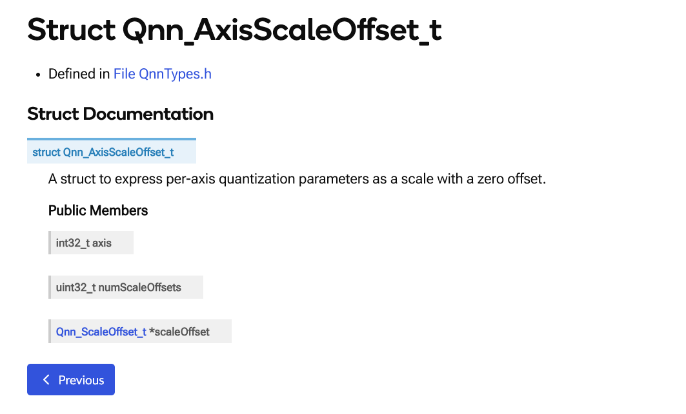
继续深入可以看到量化公式$float_value = (quantized_value + offset) * scale$，如下图, 
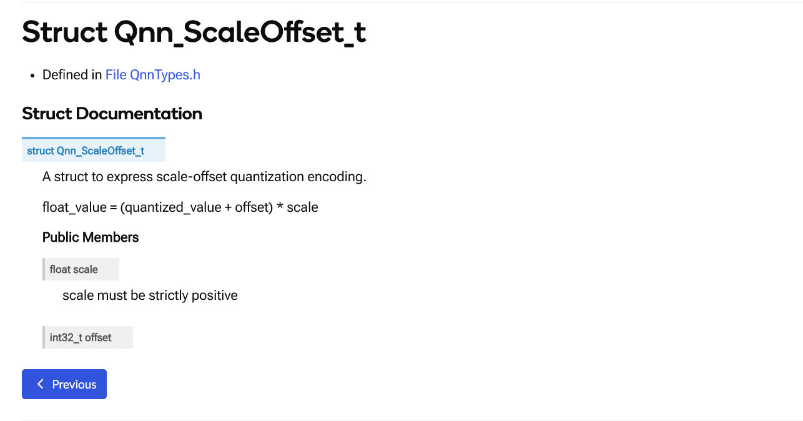

## 4. 数据类型

在算子定义中看到了数据类型的约束，但是查文档只能查到粗糙的枚举类型，没有具体刻画各个数据类型的细节，如下图
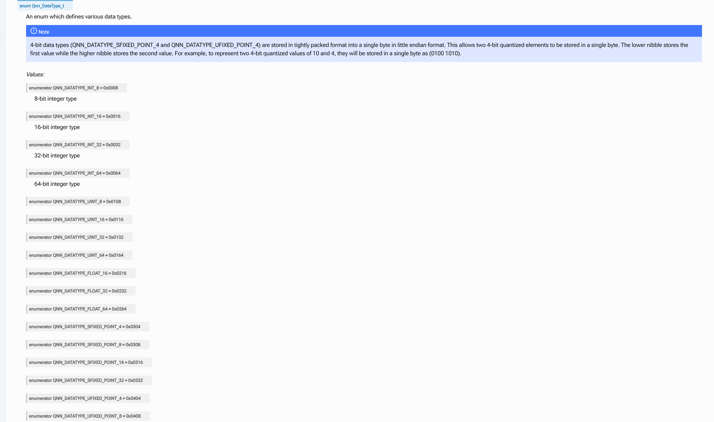
直接喂给 `codex` 查文档，
> `Qnn_DataType_t` 的分类定义在 `/root/qairt/2.40.0.251030/include/QNN/QnnTypes.h:103`：
> - `INT_*`: 有符号整数，精确整数语义
> - `UINT_*`: 无符号整数，精确整数语义
> - `FLOAT_*`: 浮点
> - `SFIXED_POINT_*`: 有符号定点/量化类型
> - `UFIXED_POINT_*`: 无符号定点/量化类型
> - `BOOL_8`
> - `STRING`
