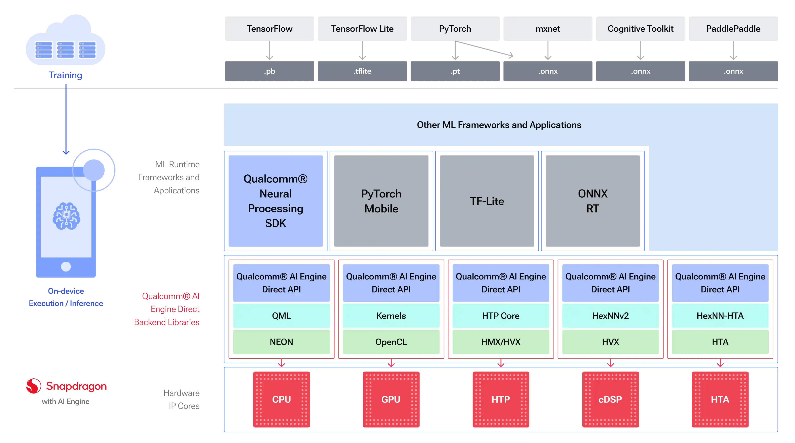
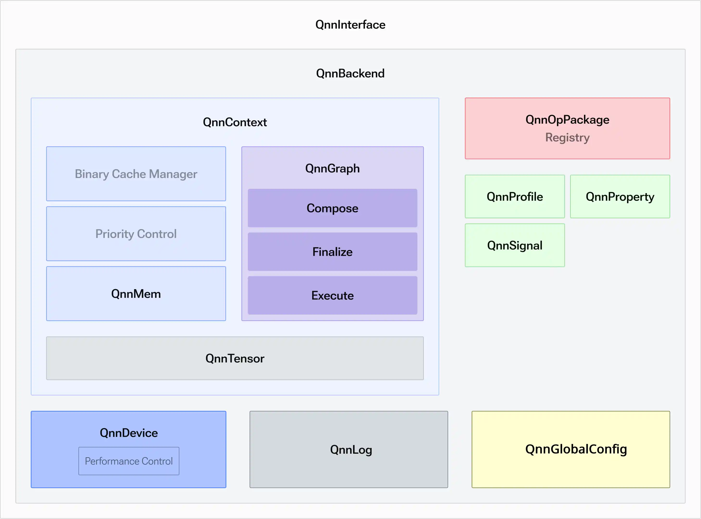
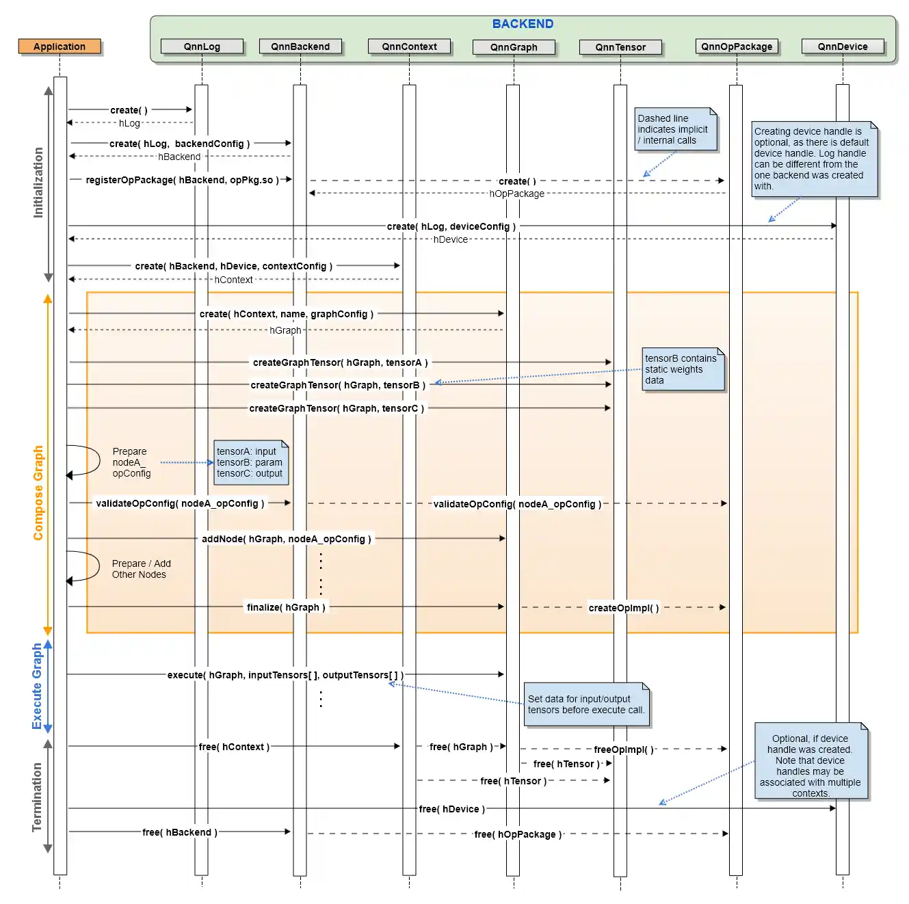
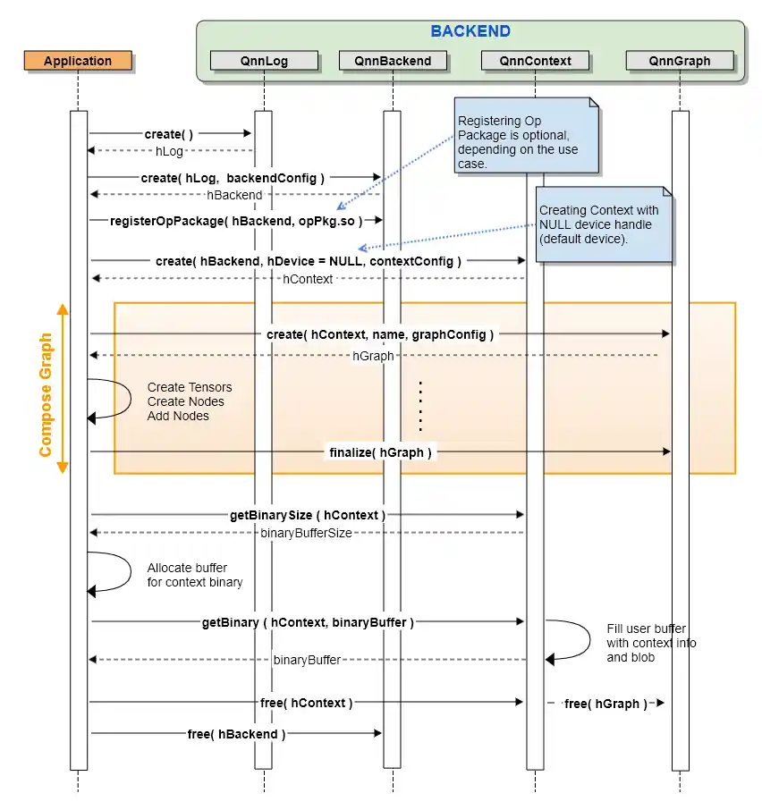
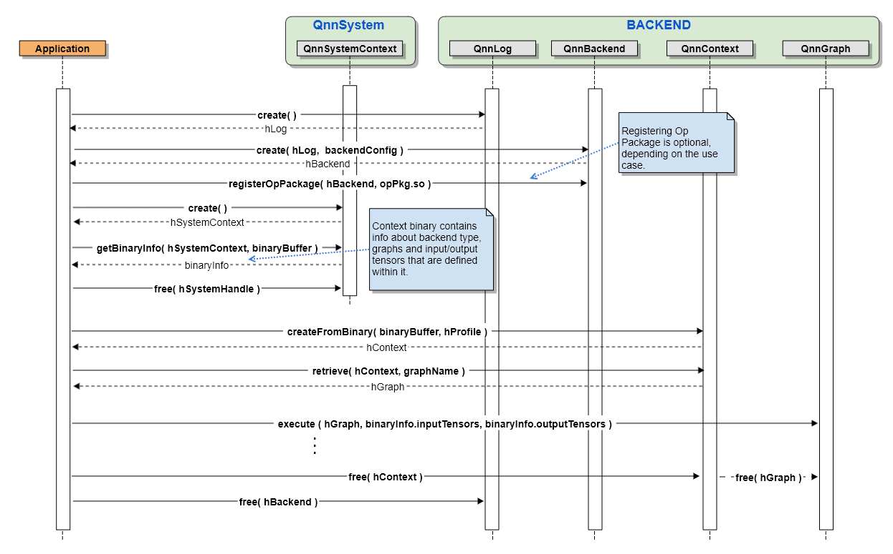

# QNN 介绍与 API 执行流程

## 1. QNN 是什么

[`QNN SDK`](https://docs.qualcomm.com/nav/home/general_introduction.html?product=1601111740010412) 是 Qualcomm 官方提供的多设备推理开发套件，支持 Android 和 Linux 端的 `CPU`、`GPU`、`HTP` 等后端。如图 1 所示，它在应用和具体硬件之间提供了一层统一抽象，让上层尽量使用同一套接口。

*图 1. QNN 软件架构示意。*

可以把 QNN 理解成两层：

- 上层是一套统一的 `C API`。
- 下层是不同硬件后端的实现，最常见的是 `CPU`、`GPU` 和 `HTP`。

QNN 想做的是把“计算描述”和“硬件执行”拆开。应用层尽量复用同一套接口，而底层切换后端时，主要差异体现在：

- 加载的后端动态库不同。
- 计算图是否能被编译到目标硬件不同。
- 张量的数据类型、量化参数和内存描述要求不同。

下面列出部分支持的高通平台，详细列表可以参考[官方文档](https://docs.qualcomm.com/nav/home/QNN_general_overview.html?product=1601111740010412#software-architecture)。

**表 1. 部分支持的 Snapdragon 平台**

| Snapdragon Device/Chip | Supported Toolchains | SOC Model | Hexagon Arch | LPAI Arch |
| :--- | :--- | :---: | :---: | :---: |
| SD 8 Elite Gen 5 (SM8850) | `aarch64-android` | 87 | V81 | v6 |
| SD 8 Elite (SM8750) | `aarch64-android` | 69 | V79 | v5 |
| SD 8 Gen 3 (SM8650) | `aarch64-android` | 57 | V75 | – |

## 2. 关键组件

QNN 文档把 API 组件分成了 `Core`、`Utility`、`System` 三类。  
如图 2 所示，`Core` 负责执行主链，`Utility` 负责性能分析和日志，`System` 负责运行时配套能力。

*图 2. QNN API 组件分类。*

### 2.1 Core 组件

- `QnnBackend`
  顶层 QNN API 组件之一。大多数 QNN API 都要求先初始化后端；同时也提供 `OpPackage` 注册相关能力。
- `QnnDevice`
  顶层 QNN API 组件之一，用来描述设备和多核资源。一个平台可能包含多个设备，每个设备又可能包含多个核心；同时还提供性能控制能力。
- `QnnContext`
  为计算图和执行操作提供执行环境。计算图以及跨图共享的张量都创建在同一个上下文中；上下文还可以被缓存成二进制形式，供后续更快加载。
- `QnnGraph`
  提供可组合的计算图 API。计算图创建在上下文内部，由节点和张量组成；调用 `finalize` 之后才进入可执行状态。
- `QnnGlobalConfig`
  用于设置全局配置参数。
- `QnnTensor`
  用来表示静态常量数据，或者输入输出激活数据。张量可以具有 `Context` 作用域，也可以具有 `Graph` 作用域；同一个上下文下的多个计算图可以共享 `Context` 作用域张量。
- `QnnOpPackage`
  提供后端使用已注册算子包库的接口，这部分也对应自定义算子的扩展能力。

### 2.2 Utility 组件

- `QnnProfile`
  提供性能分析能力，用来评估计算图和操作的性能，包括时间和内存。
- `QnnLog`
  提供日志输出能力，`QnnBackend` 和 `QnnOpPackage` 都可以使用，并且它可以早于 `QnnBackend` 初始化。

### 2.3 System 组件

- `QnnProperty`
  提供能力查询接口，客户端可以在不初始化 `QnnBackend` 的情况下直接查询后端能力。
- `QnnMem`
  用来把外部分配的内存注册到后端。
- `QnnSignal`
  提供信号对象管理能力，用来控制其他组件的执行。

如果只记主线，可以先抓住下面几个对象：

- `QnnBackend`：决定你使用哪个后端。
- `QnnDevice`：决定后端最终落到哪个设备、哪个核心。
- `QnnContext`：决定计算图的执行环境，以及图之间是否共享资源。
- `QnnGraph`：决定真正要执行的计算图。
- `QnnTensor`：决定图里每条边到底是什么数据。

后面在讲缓存加载执行时，还会遇到 `QnnSystemContext`。  
它不属于这里的执行主链对象，但在读取上下文二进制元信息时非常关键。

## 3. 执行路径

QNN 常见执行路径可以分成两类：

- 在线构图执行
- 离线缓存执行

### 3.1 在线构图执行

在线构图执行流程如图 3 所示。

*图 3. QNN 在线构图执行流程。*

#### 3.1.1 初始化与算子包注册

运行 QNN 时，一般先创建 `QnnBackend`。  
如果需要日志能力，可以更早初始化 `QnnLog`；如果需要自定义算子，则在后端创建之后注册 `QnnOpPackage`；随后创建 `QnnContext`。

#### 3.1.2 构图与定型

在 `QnnContext` 中，通过 `QnnGraph_create()` 创建一张空计算图，随后逐步往图中添加张量和节点，最终形成完整计算图。  
图构建完成之后，再调用 `QnnGraph_finalize()` 完成图定型，并触发后续的图优化和编译工作。

QNN 对张量类型做了明确区分：

- 图输入张量：`QNN_TENSOR_TYPE_APP_WRITE`
- 图输出张量：`QNN_TENSOR_TYPE_APP_READ`
- 图内部中间张量：`QNN_TENSOR_TYPE_NATIVE`
- 静态常量张量：`QNN_TENSOR_TYPE_STATIC`
- 用来连接多个计算图的上下文张量：`QNN_TENSOR_TYPE_APP_READWRITE`

这里有几个特别重要的约束：

- 张量名字在同一个上下文内必须唯一，重名属于未定义行为。
- QNN 没有提供删除已注册节点或张量的 API。
- 往图里添加节点时，顺序应该遵守依赖顺序。

#### 3.1.3 图执行

计算图构建完成之后，应用就可以开始执行。QNN 提供两类执行接口：

- 同步执行：`QnnGraph_execute()`
- 异步执行：`QnnGraph_executeAsync()`

异步接口会额外带上一组通知参数，用来在执行结束时通知应用。

#### 3.1.4 资源释放

执行完成之后，应用可以通过 `QnnContext_free()` 销毁自己创建的上下文。  
上下文被释放时，它持有的计算图也会一起销毁。

之后，再通过 `QnnBackend_free()` 释放后端句柄。  
这一步会让整个后端相关的资源和句柄失效。

### 3.2 离线缓存执行

#### 3.2.1 上下文缓存

QNN 允许应用把已经构好的计算图和上下文缓存成二进制形式，供后续复用。

*图 4. QNN 上下文缓存流程。*

在建图完成之后，可以通过 `QnnContext_getBinary()` 获取上下文的二进制形式；如果需要预估缓存大小，则可以先调用 `QnnContext_getBinarySize()`。  
把这份二进制数据保存下来，就完成了上下文缓存。

#### 3.2.2 缓存加载与执行

QNN 也可以直接跳过建图部分，加载前面生成好的上下文二进制数据，然后直接进入执行阶段，如图 5 所示。

*图 5. QNN 缓存加载执行流程。*

这条路径里最关键的几个接口是：

- `QnnContext_createFromBinary()`：从缓存二进制恢复上下文。
- `QnnGraph_retrieve()`：从上下文中取回已经完成定型的计算图。
- `QnnSystemContext_getBinaryInfo()`：读取上下文二进制中的图和张量元信息。

这里还有一个容易漏掉的点：

- 自定义 `OpPackage` 不会随着上下文一起缓存。
- 加载缓存执行时，仍然需要手动调用 `QnnBackend_registerOpPackage()` 重新注册。

## 4. 参考资料

- [QNN API Overview](https://docs.qualcomm.com/nav/home/api_overview.html?product=1601111740010412)
- [QNN API Usage Guidelines](https://docs.qualcomm.com/nav/home/api_usage_guidelines.html?product=1601111740010412)
