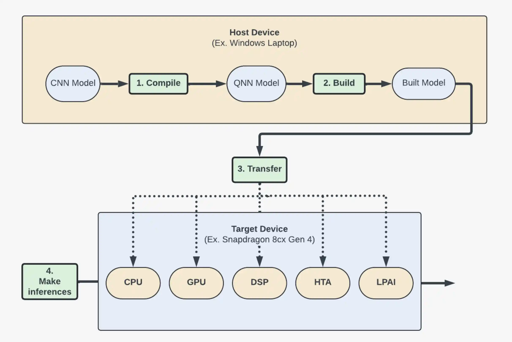
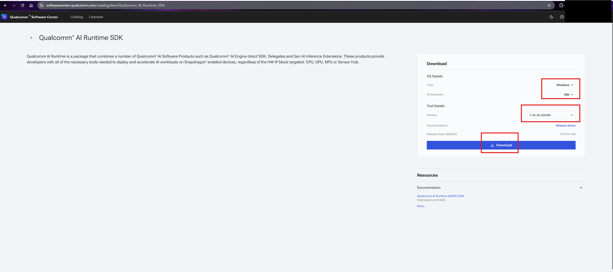

# QNN 环境准备与在线构图 MatMul 示例

这篇把 [QNN 介绍](../qnn-intro/) 里的在线构图执行方式整理成一个最小 `C++` 示例，并且把同一份代码在`CPU`、 `GPU`、`HTP` 上跑通。

- 执行环境如下
  - 宿主机：`Ubuntu 22.04 x86_64`
  - QNN SDK：`2.40.0.251030`
  - Android NDK：`android-ndk-r29`
  - SoC：`SnapDragon 8 elite`, `Chip: SM8750`, `Hexagon Arch: v79`
  - Backend：`CPU/GPU/HTP`

## 1. 环境配置

`QNN` 开发需要在有 `QNN SDK` 的宿主机（`Host Device`）开发，编译等完成后推送到有高通硬件的目标机器（`Target Device`）上运行，大致如下图。


*图 1. QNN 宿主机与目标设备开发流程。*

### 1.1 QNN 环境配置
- 方式一: 下载解压`QNN SDK`：在 [QNN SDK](https://www.qualcomm.com/developer/software/qualcomm-ai-engine-direct-sdk) 网站可以直接通过 `Get Software` 下载最新版的 `QNN SDK`。如果需要旧版本，需要注册高通账号，在 [Qualcomm® software center](https://softwarecenter.qualcomm.com/catalog/item/Qualcomm_AI_Runtime_SDK) 中找对应版本下载。
  
  *图 2. QNN SDK 下载页面。*
  **部分受限的高通软件/工具需要向**[高通销售团队](https://www.qualcomm.com/support/contact/forms/contact-sales-tools) **申请访问权限。**
  - 找个路径解压 SDK, 获得一个类似 `/root/qairt/2.40.0.251030` 的路径
  - 配置环境变量：`cd /root/qairt/2.40.0.251030/bin && source envsetup.sh ` 包括了 `QNN_SDK_ROOT` 环境变量和一些工具链路径，配置在 `~/.bashrc` 或者 `~/.zshrc` 里会更方便一些。
  - 安装依赖：`sudo /root/qairt/2.40.0.251030/bin/check-linux-dependency.sh`
  - 检查环境：`/root/qairt/2.40.0.251030/bin/envcheck -c`
  - 后续 `python` 需要使用给定的 [依赖版本](https://docs.qualcomm.com/nav/home/linux_setup.html?product=1601111740010412#step-6-optional-additional-packages)

- 方式二: `qsc安装`:[Qualcomm Software Center](https://docs.qualcomm.com/doc/80-72780-2/topic/install_qsc.html#install-qsc-for-linux)有cli版本供`linux`环境安装,
  ```bash
  # 下载安装
  ➜ curl -L https://softwarecenter.qualcomm.com/api/download/software/tools/Qualcomm_Software_Center/Linux/Debian/latest.deb -o qsc_installer.deb
  ➜ sudo apt install ./qsc_installer.deb

  # 登录
  ➜ qsc-cli login -u <your username>
  ➜ qsc-cli sdk --help
  Usage: qsc-cli sdk [options] [command]

  Sdk workflows

  Options:
    -h,--help            Display help for this command

  Commands:
    license              Activate, deactivate, or list sdk licenses
    download [options]   Download a sdk or its release notes
    install [options]    Install a sdk
    uninstall [options]  Uninstall the currently installed sdk
    info [options]       Show information for available or installed sdks

  Refer to "qsc-cli sdk <command> --help" for more details and sample usage

  ➜ qsc-cli sdk info # 查看可用的SDK列表
  [Info]: Starting qsc-cli version 1.26.6...
  Audio1.x
  HexagonSDK4.x
  HexagonSDK5.x
  HexagonSDK6.x
  LPAI
  qualcomm_ai_engine_direct
  Qualcomm_AI_Runtime_Community
  Qualcomm_AI_Runtime_SDK
  Qualcomm_Aware_Location_Android_LocationProvider
  Qualcomm_Aware_Location_Android_SDK
  Qualcomm_Aware_Location_Embedded_Client
  Qualcomm_Aware_Location_Evaluation_Tools
  Qualcomm_Aware_Location_Native_SDK
  Qualcomm_IRF_SDK
  Qualcomm_IRP_SDK
  qualcomm_neural_processing_sdk
  qualcomm_neural_processing_sdk_public
  QualcommSimulationPlatformSDK

  # 查看sdk使用命令 
  ➜  ~ qsc-cli sdk info --help
  Usage: qsc-cli sdk info [options]

  Show information for available or installed sdks

  Options:
    -n, --name <string>  Name of the sdk
    -c, --components     Display components information
    --json               Display information in JSON format
    --installed          Display only installed sdks information
    --latest-version     Display only latest available version
    -h,--help            Display help for this command

  Example command to display all sdks: qsc-cli sdk info

  Example command: qsc-cli sdk info --name <string> --latest-version

  Example command: qsc-cli sdk info --name <string> --components --installed --json

  ➜  ~ qsc-cli sdk info -n Qualcomm_AI_Runtime_SDK # 查看可安装版本
  [Info]: Starting qsc-cli version 1.26.6...


  Name                   : Qualcomm_AI_Runtime_SDK
  Installed version      : None
  Available version(s)   : 2.45.40.260406
                          2.45.1.260416
                          2.45.0.260326
                          2.44.0.260225
                          2.43.1.260218
                          2.43.0.260128
                          2.42.0.251225
                          2.41.0.251128
                          2.40.1.251119
                          2.40.0.251030
                          2.39.3.251009
                          2.39.0.250926
                          2.38.1.251113
                          2.38.0.250901
                          2.37.1.250807
                          2.37.0.250724
                          2.36.4.250725
                          2.36.3.250722
                          2.36.1.250708
                          2.36.0.250627
                          2.35.6.250717
                          2.35.3.250617
                          2.35.0.250530
                          2.34.2.250528
                          2.34.1.250516
                          2.34.0.250424
                          2.33.2.250410
                          2.33.0.250327
                          2.32.6.250402
                          2.32.0.250228

  ➜ qsc-cli sdk install --help # 查看安装SDK的命令和参数
  Usage: qsc-cli sdk install [options]

  Install a sdk

  Options:
    -n, --name <string>               Name of the sdk
    --activate-default-license        Activate default license before installation
    -rv, --required-version <string>  Preferred version
    --config <string>                 Configuration file or settings to use during install
    --path <path>                     Preferred install path
    -f, --force                       Force installation despite script or add-on errors
    -s, --silent                      Install sdk silently without any user prompts
    -h,--help                         Display help for this command

  Example command: qsc-cli sdk install --name <string> --required-version <string> --config <string> --silent --force --activate-default-license

  ➜ qsc-cli sdk install -n Qualcomm_AI_Runtime_SDK --path /root/QNN -rv 2.40.0.251030 # 安装指定版本的QNN SDK到/root/QNN目录
  [Info]: Starting qsc-cli version 1.26.6...
  [Info] : Downloading package file for product Qualcomm_AI_Runtime_SDK for version 2.40.0.251030
  [Info] : Downloading... 100%
  [Info] : Downloaded package file to /tmp/QIKCache/88f4a6db-ddff-11ef-9172-02ddcb07e973/8f369776-b87d-11f0-ae67-064291a33d05/Qualcomm_AI_Runtime_SDK.2.40.0.251030.Linux-AnyCPU.qik

  Access to and use of tools managed by the Qualcomm Package Manager are subject to the terms and conditions of the corresponding agreement(s) in place with Qualcomm Technologies, Inc. or its affiliates.
  Unauthorized access or use is prohibited. Information such as tool version, operating system, user ID, company ID, IP address, computer mac address, date, timestamp, or features and functions of our tools that you use may be collected for internal business purposes or tool improvements and is subject to the Qualcomm Privacy Policy [http://www.qualcomm.com/site/privacy].
  By accessing or using this tool, you agree to the foregoing.
  Copyright (c) Qualcomm Technologies, Inc. and/or its subsidiaries. All rights reserved.


  Accept and continue with installation [y/n] : y

  [Warning] : Qualcomm_AI_Runtime_SDK is of the ExtractOnly type. The install command will automatically perform the extraction
  [Info] : Step 1 of 7: Checking environment
  [Info] : Step 2 of 7: Checking previous version
  [Info] : Step 3 of 7: Checking dependencies
  [Info] : Step 4 of 7: Preparing system
  [Info] : Step 5 of 7: Extracting files
  [Info] : Step 6 of 7: Configuring system
  [Info] : Step 7 of 7: Finishing installation
  [Info] : SUCCESS: Installed Qualcomm_AI_Runtime_SDK.Core at /root/QNN
  [Info] : Log File Location: file:///var/tmp/qcom/qik/logs/462d10c5-b37e-4089-9e16-5056800f0869/qiktool.20260428.1.log

  ```
  - 通过这个方式安装也需要自己设置环境变量，目录在`/root/QNN/bin/envsetup.sh` 这个路径是因为安装时指定了路径，这样激活的环境变量和前面略有不同，使用起来要注意，也可以自己设置相同名称的环境变量。


### 1.2 Android 交叉编译环境配置

- 步骤1：下载最新版软件包，[获取地址](https://developer.android.google.cn/ndk/downloads?hl=zh-cn)（选择对应平台最新稳定版，点击后出现 “Android 软件开发套件许可协议”，勾选后鼠标右键下载按钮可以复制下载链接）

  ```bash
  # 服务器端运行
  # 到指定目录下载并解压 `android_ndk`
  cd ~ && mkdir android_ndk && cd ~/android_ndk
  wget https://googledownloads.cn/android/repository/android-ndk-r29-linux.zip
  unzip android-ndk-r29-linux.zip # 这个文件名和下载的版本有关
  # 删除压缩包
  rm android-ndk-r29-linux.zip # 这个文件名和下载的版本有关

  # 进入并记住解压后的目录
  # 在目录里用 `pwd` 命令可以获取绝对路径
  cd android-ndk-r29 # 这个目录和下载的版本有关，可以通过 `ls -lah` 显示目录
  ```

- 步骤2：配置环境变量

  ```bash
  # 服务器端运行
  # 通常会配置 `ANDROID_NDK_ROOT` 环境变量
  # 但 `MNN` 中在 `project/android/build_64.sh` 使用的是 `$ANDROID_NDK` 环境变量，所以都设置一下
  ➜ export ANDROID_NDK="$HOME/android_ndk/android-ndk-r29" # 环境变量
  ➜ $ANDROID_NDK/ndk-build --version  # 验证环境变量
  GNU Make 4.3
  Built for x86_64-pc-linux-gnu
  Copyright (C) 1988-2020 Free Software Foundation,  Inc.
  License GPLv3+: GNU GPL version 3 or later <http://gnu.org/licenses/gpl.html>
  This is free software: you are free to change and redistribute it.
  There is NO WARRANTY,  to the extent permitted by law.

  # 在命令行单次export只会在当前命令行有效 新开的终端不生效
  # 需要把环境变量写到 `shell` 的配置文件中，`bash` 对应 `~/.bashrc`，`zsh` 对应 `~/.zshrc`
  # !!注意这里重定向是重定向文件末尾 '>>' 符号
  echo 'export ANDROID_NDK="$HOME/android_ndk/android-ndk-r29"' >> ~/.zshrc # 环境变量
  echo 'export ANDROID_NDK_ROOT="$HOME/android_ndk/android-ndk-r29"'  >> ~/.zshrc # 环境变量
  echo 'export PATH="$ANDROID_NDK:$PATH"' >> ~/.zshrc
  # 验证
  ➜  ndk-build
  Android NDK: Could not find application project directory !
  Android NDK: Please define the NDK_PROJECT_PATH variable to point to it.
  /root/android_ndk/android-ndk-r29/build/core/build-local.mk:151: *** Android NDK: Aborting    .  Stop.
  ```

## 2. 执行流程

下面的示例是计算$C = A \times B$，对应的执行链如下：

```text
动态加载 `backend` 动态库
-> QnnInterface_getProviders()
-> QnnBackend_create()
-> QnnContext_create()
-> QnnGraph_create()
-> QnnTensor_createGraphTensor()
-> QnnGraph_addNode()
-> QnnGraph_finalize()
-> QnnGraph_execute()
-> 校验输出
```

对照执行流程图为：

*图 3. QNN 在线构图执行流程。*


### 2.1 初始化

下面例子调用的内置 `MatMul` 算子，无需注册自定义算子，所以初始化阶段相对简单，主要是创建上下文、设备、图等资源：
```cpp
qnnInterface.logCreate(qnnLogCallback, logLevel, &logger);          // 注册log
qnnInterface.backendCreate(logger, nullptr, &backend);              // 创建backend
qnnInterface.deviceCreate(logger, configs, &device);                // 创建设备
qnnInterface.contextCreate(backend, device, nullptr, &context);     // 创建上下文
qnnInterface.graphCreate(context, "matmul_graph", nullptr, &graph); // 创建图
```

### 2.2 图构建
#### 2.2.1 创建张量
在 QNN 图里，这三个张量分别对应：

- `A`：`QNN_TENSOR_TYPE_APP_WRITE`
- `B`：`QNN_TENSOR_TYPE_STATIC`
- `C`：`QNN_TENSOR_TYPE_APP_READ`

```cpp
    
// 构建测试数据和张量描述
constexpr uint32_t kRows      = 32;
constexpr uint32_t kInner     = 128;
constexpr uint32_t kCols      = 64;
constexpr uint32_t kTensorRank = 2;
std::vector<float> inputData  = makeInputData(kRows * kInner, 23, 11.0f);
std::vector<float> weightData = makeInputData(kInner * kCols, 17, 9.0f);
std::vector<float> outputData(kRows * kCols, std::numeric_limits<float>::quiet_NaN());

std::array<uint32_t, kTensorRank> inputDims  = {kRows, kInner};
std::array<uint32_t, kTensorRank> weightDims = {kInner, kCols};
std::array<uint32_t, kTensorRank> outputDims = {kRows, kCols};

// 创建tensor描述
Qnn_Tensor_t inputTensor = makeTensor("input",
                                      QNN_TENSOR_TYPE_APP_WRITE,
                                      QNN_DATATYPE_FLOAT_32,
                                      inputDims.data(),
                                      kTensorRank,
                                      nullptr,
                                      0);
Qnn_Tensor_t weightTensor = makeTensor("weight",
                                        QNN_TENSOR_TYPE_STATIC,
                                        QNN_DATATYPE_FLOAT_32,
                                        weightDims.data(),
                                        kTensorRank,
                                        weightData.data(),
                                        static_cast<uint32_t>(weightData.size() * sizeof(float)));
Qnn_Tensor_t outputTensor = makeTensor("output",
                                        QNN_TENSOR_TYPE_APP_READ,
                                        QNN_DATATYPE_FLOAT_32,
                                        outputDims.data(),
                                        kTensorRank,
                                        nullptr,
                                        0);

/* Tensor构造函数需要绑定多个config信息
  Qnn_Tensor_t makeTensor(const char* name,
                      Qnn_TensorType_t type,
                      Qnn_DataType_t dataType,
                      uint32_t* dimensions,
                      uint32_t rank,
                      void* data,
                      uint32_t dataSize) {
    Qnn_Tensor_t tensor = QNN_TENSOR_INIT;
    tensor.version      = QNN_TENSOR_VERSION_1; // 张量版本
    tensor.v1.name      = name;
    tensor.v1.type      = type;
    tensor.v1.dataFormat = QNN_TENSOR_DATA_FORMAT_FLAT_BUFFER; // 内存类型
    tensor.v1.dataType   = dataType;
    tensor.v1.rank       = rank; // 张量维度数量
    tensor.v1.dimensions = dimensions; // 张量维度信息
    tensor.v1.memType    = QNN_TENSORMEMTYPE_RAW; // 内存分配方式
    tensor.v1.clientBuf.data = data; // 这里的data是一个指针，指向实际的数据buffer
    tensor.v1.clientBuf.dataSize = dataSize; // buffer的大小，单位是字节
    return tensor;
  }
*/

// 把张量注册到图里
qnnInterface.tensorCreateGraphTensor(graph, &inputTensor);
qnnInterface.tensorCreateGraphTensor(graph, &weightTensor);
qnnInterface.tensorCreateGraphTensor(graph, &outputTensor);
```

- `Qnn_Tensor_t` 是一个 `union`，底层可以使用 `Qnn_TensorV1_t` 或者 `Qnn_TensorV2_t` 两种版本的结构体来描述张量信息。
- `Qnn_TensorMemType_t` 共有三种方式，`QNN_TENSORMEMTYPE_RAW` 提供原始指针，`QNN_TENSORMEMTYPE_MEMHANDLE` 提供内存对象，可以在 `QNN` 设备间内存共享，`QNN_TENSORMEMTYPE_RETRIEVE_RAW` 通过回调函数提供原始指针。
- `clientBuf` 字段也是一个 `union`，还可以使用 `memHandle` 对应上面的内存对象。这里的 `weight` 张量是静态的，所以在注册的时候就把 `data buffer` 绑定上了；而 `input` 和 `output` 张量是动态的，可以先注册一个不带 `data buffer` 的描述，等到执行阶段再绑定真正的 `buffer`。


#### 2.2.2 创建节点

节点定义也需要绑定很多信息：
```cpp
// 目前只有v1版本
Qnn_OpConfig_t opConfig = QNN_OPCONFIG_INIT; 
opConfig.v1.name          = "matmul_0";
opConfig.v1.packageName   = QNN_OP_PACKAGE_NAME_QTI_AISW;
opConfig.v1.typeName      = QNN_OP_MAT_MUL;
opConfig.v1.numOfParams   = 0;       // 额外参数数量
opConfig.v1.params        = nullptr; // 额外参数数据
// 绑定输入输出张量
opConfig.v1.numOfInputs   = static_cast<uint32_t>(nodeInputs.size()); 
opConfig.v1.inputTensors  = nodeInputs.data();
opConfig.v1.numOfOutputs  = static_cast<uint32_t>(nodeOutputs.size());
opConfig.v1.outputTensors = nodeOutputs.data();

// 把节点加入图中
qnnInterface.graphAddNode(graph, opConfig);
```

### 2.4 完成构图并执行

完成构图后就可以执行图计算：
```cpp
// 图构建完成后，调用 finalize 把图定型
qnnInterface.graphFinalize(graph, nullptr, nullptr);

// 构建执行张量，绑定真正的输入输出 buffer
Qnn_Tensor_t executeInput = makeExecuteTensor(
    inputTensor, inputData.data(), inputData.size() * sizeof(float));
Qnn_Tensor_t executeOutput = makeExecuteTensor(
    outputTensor, outputData.data(), outputData.size() * sizeof(float));

// 执行图计算
qnnInterface.graphExecute(graph,
                          &executeInput,
                          1,
                          &executeOutput,
                          1,
                          nullptr,
                          nullptr);
```
- `QnnTensor_createGraphTensor()` 注册的是图里的张量元信息，不是这次执行的 I/O buffer。
- 真正的数据 buffer 是在 `makeExecuteTensor()` 之后、`QnnGraph_execute()` 之前才绑定进去的。

### 2.5 资源释放

逐步释放上下文等资源
```cpp
qnnInterface.contextFree(context, nullptr);
qnnInterface.deviceFree(device);
qnnInterface.deviceFreePlatformInfo(logger, platformInfo);
qnnInterface.backendFree(backend);
qnnInterface.logFree(logger);
```


## 3. 构建

- 📦 先准备环境变量，通常只需要把 `QNN_SDK_ROOT` 指向 `QNN SDK` 路径就行了, 或者使用前面的 `cd /root/qairt/2.40.0.251030/bin && source envsetup.sh` 来加载一系列环境变量。保证`echo $QNN_SDK_ROOT && echo ANDROID_NDK_ROOT`能正确输出 SDK和NDK 路径。
- 🛠️ 交叉编译, 这里同时使用了 `QNN SDK` 和 `Android NDK` 的工具链文件。
- 📱 这里统一使用根目录 `build/`。host 和 Android 交叉编译都走这个目录，但切换 toolchain 前需要先清理旧缓存。
- ⚠️ shell 续行的反斜杠 `\` 后面不要直接跟注释，否则后续 `-D...` 参数会被 shell 当成单独命令执行。
  ```bash
  # 确保环境变量正常
  # export QNN_SDK_ROOT=/root/qairt/2.40.0.251030
  # export ANDROID_NDK_ROOT=/root/android-ndk/android-ndk-r29

  cmake -S . -B build \
    -DCMAKE_TOOLCHAIN_FILE="$ANDROID_NDK_ROOT/build/cmake/android.toolchain.cmake" \
    -DANDROID_ABI=arm64-v8a \
    -DANDROID_PLATFORM=android-31 \
    -DCMAKE_EXPORT_COMPILE_COMMANDS=ON

  cmake --build build -j4 --target qnn_online_matmul
  ```
- ✅ 推送到手机的可执行文件应该来自当前 Android 配置的 `build/`，不能把宿主机 `x86_64` 产物直接推到 Android 设备上。
- ✅ 如果刚刚把 `build/` 配成 host，再切到 Android，先删掉 `build/CMakeCache.txt` 或整个 `build/` 再重新配置。

## 4. 目标设备运行

- 把依赖的动态库等文件推送给 `adb` 设备
- 运行时需要设置环境变量 `LD_LIBRARY_PATH` 指向动态库所在目录，`ADSP_LIBRARY_PATH` 指向 `HTP` 相关库所在目录（如果需要跑 `HTP` 的话），以保证动态库能被正确加载到内存里。

### 4.1 GPU 测试

`QNN` 默认的 `GPU` 后端是 `Opencl`，依赖部分动态库，需要推送 `GPU` 运行所需文件：

```bash
export GPU_DIR=/data/local/tmp/qnn_online_matmul_gpu # 设备侧的目录，可以根据需要修改
adb -s 127.0.0.1:40404 shell "mkdir -p $GPU_DIR"     # 这里的adb命令需要根据实际情况修改，确保能连接到目标设备

adb -s 127.0.0.1:40404 push \
  build/qnn_online_matmul \
  $QNN_SDK_ROOT/lib/aarch64-android/libQnnGpu.so \
  $ANDROID_NDK_ROOT/toolchains/llvm/prebuilt/linux-x86_64/sysroot/usr/lib/aarch64-linux-android/libc++_shared.so \
  $GPU_DIR/
```

执行设备侧的 `GPU` 测试：

```bash
> adb -s 127.0.0.1:40404 shell "
  cd $GPU_DIR && \
  export LD_LIBRARY_PATH=$GPU_DIR && \
  ./qnn_online_matmul ./libQnnGpu.so --dump-backend-info
"

Backend Info
backend_path  : ./libQnnGpu.so
backend_kind  : GPU
provider_count: 1
provider[0]
  backend_id        : 4 (GPU)
  provider_name     : GPU_QTI_AISW
  core_api_version  : 2.30.0
  backend_api_ver   : 3.12.0
  selected          : yes
selected_core_api   : 2.30.0
selected_backend_api: 3.12.0
backend_build_id: v2.40.0.251030114326_189385
api_entries
  propertyHasCapability             yes
  backendGetApiVersion              yes
  backendGetBuildId                 yes
  deviceCreate                      yes
  deviceGetPlatformInfo             yes
  contextCreate                     yes
  graphCreate                       yes
  tensorCreateGraphTensor           yes
  graphFinalize                     yes
  graphExecute                      yes
capabilities
  device_api_group                  supported
  backend_support_op_package        supported
  backend_support_composition       supported
  context_support_caching           supported
  graph_support_execute             supported
  graph_support_async_execution     not_supported
  graph_support_online_prepare      supported
  tensor_support_context_tensors    supported
  tensor_support_dynamic_dimensions not_supported
QNN online MatMul example
backend_path : ./libQnnGpu.so
backend_kind : GPU
tolerance    : 0.0001
shape        : A[32, 128] x B[128, 64] -> C[32, 64]
max_abs_err  : 0.00000119
mean_abs_err : 0.00000028
validation   : PASS
output[0:8]  : -1.58585858 1.19191921 0.87878758 -2.18181872 0.25252536 1.82828355 0.31313074 -0.17171730

Time Breakdown
stage                           time(us)
----------------------------------------
load_backend_library               15900
resolve_qnn_interface                  5
backend_create                     48781
dump_backend_info                     63
device_create                        268
context_create                        19
graph_create                          17
tensor_create                       2360
graph_add_node                        18
graph_finalize                    331536
graph_execute                        571
result_validate                       25
```

### 4.2 HTP 测试
推送 `HTP` 运行所需文件：

```bash
export HTP_DIR=/data/local/tmp/qnn_online_matmul_htp
adb -s 127.0.0.1:40404 shell "mkdir -p $HTP_DIR"

adb -s 127.0.0.1:40404 push \
  build/qnn_online_matmul \
  $QNN_SDK_ROOT/lib/aarch64-android/libQnnHtp.so \
  $QNN_SDK_ROOT/lib/aarch64-android/libQnnHtpPrepare.so \
  $QNN_SDK_ROOT/lib/aarch64-android/libQnnHtpV79Stub.so \
  $QNN_SDK_ROOT/lib/hexagon-v79/unsigned/libQnnHtpV79Skel.so \
  $ANDROID_NDK_ROOT/toolchains/llvm/prebuilt/linux-x86_64/sysroot/usr/lib/aarch64-linux-android/libc++_shared.so \
  $HTP_DIR/
```
执行设备侧的 `HTP` 测试：

```bash
adb -s 127.0.0.1:40404 shell "
  cd $HTP_DIR && \
  export LD_LIBRARY_PATH=$HTP_DIR && \
  export ADSP_LIBRARY_PATH=$HTP_DIR && \
  ./qnn_online_matmul ./libQnnHtp.so --dump-backend-info
"

Backend Info
backend_path  : ./libQnnHtp.so
backend_kind  : NPU
provider_count: 1
provider[0]
  backend_id        : 6 (HTP)
  provider_name     : HTP_QTI_AISW
  core_api_version  : 2.30.0
  backend_api_ver   : 5.40.0
  selected          : yes
selected_core_api   : 2.30.0
selected_backend_api: 5.40.0
backend_build_id: v2.40.0.251030114326_189385
api_entries
  propertyHasCapability             yes
  backendGetApiVersion              yes
  backendGetBuildId                 yes
  deviceCreate                      yes
  deviceGetPlatformInfo             yes
  contextCreate                     yes
  graphCreate                       yes
  tensorCreateGraphTensor           yes
  graphFinalize                     yes
  graphExecute                      yes
capabilities
  device_api_group                  supported
  backend_support_op_package        supported
  backend_support_composition       supported
  context_support_caching           supported
  graph_support_execute             supported
  graph_support_async_execution     not_supported
  graph_support_online_prepare      supported
  tensor_support_context_tensors    not_supported
  tensor_support_dynamic_dimensions supported
QNN online MatMul example
backend_path : ./libQnnHtp.so
backend_kind : NPU
htp_soc_model: 69
htp_arch     : 79
tolerance    : 0.005
shape        : A[32, 128] x B[128, 64] -> C[32, 64]
max_abs_err  : 0.00183558
mean_abs_err : 0.00050184
validation   : PASS
output[0:8]  : -1.58691406 1.19140625 0.87841797 -2.18164062 0.25244141 1.82910156 0.31274414 -0.17224121

Time Breakdown
stage                           time(us)
----------------------------------------
load_backend_library                 869
resolve_qnn_interface                  4
backend_create                       931
dump_backend_info                     63
device_create                     102422
context_create                        80
graph_create                      203671
tensor_create                         58
graph_add_node                        39
graph_finalize                      9320
graph_execute                       2531
result_validate                       64
```

- 如果你需要看更细的 `backend` 日志，可以额外加：
```bash
export QNN_LOG_LEVEL=debug
```

#### 4.3 CPU 测试
推送 `CPU` 运行所需文件：

```bash
export CPU_DIR=/data/local/tmp/qnn_online_matmul_cpu
adb -s 127.0.0.1:40404 shell "mkdir -p $CPU_DIR"

adb -s 127.0.0.1:40404 push \
  build/qnn_online_matmul \
  $QNN_SDK_ROOT/lib/aarch64-android/libQnnCpu.so \
  $ANDROID_NDK_ROOT/toolchains/llvm/prebuilt/linux-x86_64/sysroot/usr/lib/aarch64-linux-android/libc++_shared.so \
  $CPU_DIR/
```
执行设备侧的 `CPU` 测试：
```bash
adb -s 127.0.0.1:40404 shell "
  cd $CPU_DIR && \
  export LD_LIBRARY_PATH=$CPU_DIR && \
  ./qnn_online_matmul ./libQnnCpu.so --dump-backend-info
"

Backend Info
backend_path  : ./libQnnCpu.so
backend_kind  : CPU
provider_count: 1
provider[0]
  backend_id        : 3 (CPU)
  provider_name     : CPU_QTI_AISW
  core_api_version  : 2.30.0
  backend_api_ver   : 1.1.0
  selected          : yes
selected_core_api   : 2.30.0
selected_backend_api: 1.1.0
backend_build_id: v2.40.0.251030114326_189385
api_entries
  propertyHasCapability             yes
  backendGetApiVersion              yes
  backendGetBuildId                 yes
  deviceCreate                      yes
  deviceGetPlatformInfo             yes
  contextCreate                     yes
  graphCreate                       yes
  tensorCreateGraphTensor           yes
  graphFinalize                     yes
  graphExecute                      yes
capabilities
  device_api_group                  not_supported
  backend_support_op_package        supported
  backend_support_composition       supported
  context_support_caching           supported
  graph_support_execute             supported
  graph_support_async_execution     not_supported
  graph_support_online_prepare      supported
  tensor_support_context_tensors    supported
  tensor_support_dynamic_dimensions supported
QNN online MatMul example
backend_path : ./libQnnCpu.so
backend_kind : CPU
tolerance    : 0.0001
shape        : A[32, 128] x B[128, 64] -> C[32, 64]
max_abs_err  : 0.00000000
mean_abs_err : 0.00000000
validation   : PASS
output[0:8]  : -1.58585882 1.19191945 0.87878734 -2.18181849 0.25252527 1.82828319 0.31313115 -0.17171681

Time Breakdown
stage                           time(us)
----------------------------------------
load_backend_library                2295
resolve_qnn_interface                  4
backend_create                       597
dump_backend_info                     54
device_create                          1
context_create                         7
graph_create                        1938
tensor_create                         42
graph_add_node                       117
graph_finalize                        32
graph_execute                       1066
result_validate                       47
```

## 5. `benchmark`

基于上述示例构建了一个测试不同精度/后端性能的`benchmark`，方便快速做端侧验证和横向对比。🧪

### 5.1 编译

Android 交叉编译：

```bash
# 确保环境变量正常
# export QNN_SDK_ROOT=/root/qairt/2.40.0.251030
# export ANDROID_NDK_ROOT=/root/android-ndk/android-ndk-r29

cmake -S . -B build \
  -DCMAKE_TOOLCHAIN_FILE="$ANDROID_NDK_ROOT/build/cmake/android.toolchain.cmake" \
  -DANDROID_ABI=arm64-v8a \
  -DANDROID_PLATFORM=android-31 \
  -DCMAKE_EXPORT_COMPILE_COMMANDS=ON

cmake --build build -j4 --target qnn_precision_benchmark
```

### 5.2 命令行参数

`qnn_precision_benchmark` 支持以下参数：

```text
--backend <path>         指定 backend 动态库路径
--dump-backend-info      打印 provider、interface、capability 信息
--m <rows>               左矩阵行数，默认 256
--k <inner>              矩阵归约维度，默认 512
--n <cols>               右矩阵列数，默认 512
--warmup <count>         预热次数，默认 3
--iters <count>          正式计时轮数，默认 10
--precisions <list>      精度列表，默认 fp32,int8,int16,fp16
```

如果要快速查看后端信息，也可以在运行前设置：

```bash
export QNN_DUMP_BACKEND_INFO=1
```

### 5.3 执行

下面的命令把可执行文件和三种后端需要的动态库一次性推到同一个目录：

```bash
export BENCH_DIR=/data/local/tmp/qnn_precision_benchmark
adb -s 127.0.0.1:40404 shell "mkdir -p $BENCH_DIR"

adb -s 127.0.0.1:40404 push \
  build/qnn_precision_benchmark \
  $QNN_SDK_ROOT/lib/aarch64-android/libQnnCpu.so \
  $QNN_SDK_ROOT/lib/aarch64-android/libQnnGpu.so \
  $QNN_SDK_ROOT/lib/aarch64-android/libQnnHtp.so \
  $QNN_SDK_ROOT/lib/aarch64-android/libQnnHtpPrepare.so \
  $QNN_SDK_ROOT/lib/aarch64-android/libQnnHtpV79Stub.so \
  $QNN_SDK_ROOT/lib/hexagon-v79/unsigned/libQnnHtpV79Skel.so \
  $ANDROID_NDK_ROOT/toolchains/llvm/prebuilt/linux-x86_64/sysroot/usr/lib/aarch64-linux-android/libc++_shared.so \
  $BENCH_DIR/
```

#### 5.3.1 CPU 测试

```bash
adb -s 127.0.0.1:40404 shell "
  cd $BENCH_DIR && \
  export LD_LIBRARY_PATH=$BENCH_DIR && \
  ./qnn_precision_benchmark \
    --backend ./libQnnCpu.so \
    --m 64 --k 128 --n 128 \
    --warmup 1 --iters 3
"
```

#### 5.3.2 GPU 测试

```bash
adb -s 127.0.0.1:40404 shell "
  cd $BENCH_DIR && \
  export LD_LIBRARY_PATH=$BENCH_DIR && \
  ./qnn_precision_benchmark \
    --backend ./libQnnGpu.so \
    --m 64 --k 128 --n 128 \
    --warmup 1 --iters 3
"
```

#### 5.3.3 HTP 测试

```bash
adb -s 127.0.0.1:40404 shell "
  cd $BENCH_DIR && \
  export LD_LIBRARY_PATH=$BENCH_DIR && \
  export ADSP_LIBRARY_PATH=$BENCH_DIR && \
  ./qnn_precision_benchmark \
    --backend ./libQnnHtp.so \
    --m 64 --k 128 --n 128 \
    --warmup 1 --iters 3
"
```


### 5.6 支持矩阵

以 `MatMul` 为例，当前文档和实际测试对应的支持范围如下：

- ✅ `CPU`：支持 `fp32/int8`，`int16/fp16` 会显示为 `UNSUPPORTED`
- ✅ `GPU`：支持 `fp32/fp16`，`int8/int16` 会显示为 `UNSUPPORTED`
- ✅ `HTP`：文档矩阵按 `fp16/int8/int16` 处理；如果 `fp32` 在你的设备上显示 `OK`，它表示 QNN runtime 接受了 `QNN_DATATYPE_FLOAT_32` 的图配置，不等价于 HTP 内部在做原生 FP32 MatMul

这里的 `UNSUPPORTED` 现在优先来自 `backendValidateOpConfig()` 的运行时探测；如果探测接口不可用，或者目标端 `Android + HTP + int8 MatMul` 会在 `libQnnHtpPrepare.so` 的探测路径里崩溃，就回退到文档支持矩阵，再以实际建图执行结果为准。`fp32 OK` 只能说明 API 层配置可执行；要判断内部实际精度，需要结合 HTP OpDef、backend profiling/log 和最终误差。⚠️

### 5.7 输出怎么看

输出示例如下：

```text
QNN MatMul Precision Benchmark
backend_kind : NPU
backend_path : ./libQnnHtp.so
htp_soc_model: 69
htp_arch     : 79
shape        : A[64, 128] x B[128, 128] -> C[64, 128]
warmup       : 1
iterations   : 3

Results
precision status              init(ms)     build(ms)              exec(ms)     release(ms)     total(ms)     max_abs_err    mean_abs_err
----------------------------------------------------------------------------------------------------------------------------------------
int8      OK                  205.5645        9.0797        0.7750±0.0580         22.4316      242.4618          0.0271          0.0080
int16     OK                   35.2989       30.6419        0.8010±0.1014         20.8287       94.3954          0.0042          0.0017
fp16      OK                   28.1247       29.3391        0.7863±0.0760         21.3840       86.8039          0.0017          0.0004
fp32      OK                  175.9133       10.8606        0.7313±0.0520         22.8998      214.1842          0.0017          0.0004

GPU Results
precision status              init(ms)     build(ms)              exec(ms)     release(ms)     total(ms)     max_abs_err    mean_abs_err
----------------------------------------------------------------------------------------------------------------------------------------
fp16      OK                    5.7818      340.2971        0.2037±0.0488          2.9731      350.4211          0.0017          0.0004
fp32      OK                    6.0046      332.3594        0.3467±0.2124          2.9880      343.1908          0.0000          0.0000
CPU Results
precision status              init(ms)     build(ms)              exec(ms)     release(ms)     total(ms)     max_abs_err    mean_abs_err
----------------------------------------------------------------------------------------------------------------------------------------
int8      OK                   15.4623        0.2046        0.0167±0.0081          0.5728       17.1529          0.0398          0.0115
fp32      OK                   12.4459        0.2005        0.9967±0.0615          0.2930       17.3047          0.0000          0.0000
```

各列的含义如下：

- `init/build/release/total (ms)`：初始化、建图、资源释放和总耗时
- `exec(ms)`：多轮 `QnnGraph_execute()` 的平均值和标准差，格式是 `mean±std`
- `max_abs_err`：输出和 `float` 参考值的最大绝对误差
- `mean_abs_err`：输出和 `float` 参考值的平均绝对误差
